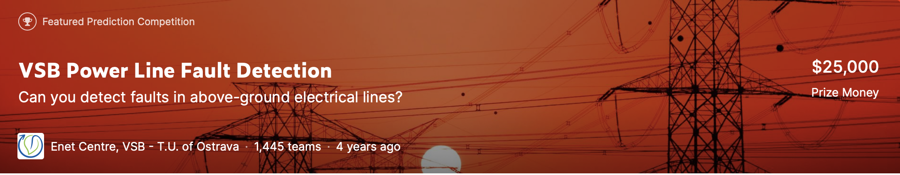

# Kaggle VSB Power Line Fault Detection

[Kaggle page](https://www.kaggle.com/c/vsb-power-line-fault-detection)

The challenge is to detect partial discharge patterns in signals acquired from these power lines with a new meter designed at the ENET Centre at VŠB. Effective classifiers using this data will make it possible to continuously monitor power lines for faults.

The different approaches were implamented to solve this problem. FFT features and time-series statistics were used as an input for the models like LightGBM, LSTM and TCN.

### Results of the different models

**fft_lgbm** folder contains

1) LightGBM with FFT features (CV 0.64, Public LB 0.53, Private LB 0.61)

**fft_nn** folder contains

1) LSTM+Attention with FFT features where each phase is considered separately (CV 0.607, Public LB 0.45, Private LB 0.609)

2) LSTM+Attention with FFT features (CV 0.682, Public LB 0.485, Private LB 0.62)

3) TCN with FFT features (CV 0.71, Public LB 0.52, Private LB 0.61)

**fft_stat_nn** folder contains

1) LSTM+Attention for FFT features and LSTM+Attention for time-series statistics from Bruno Aquino's kernel (CV 0.73, Public LB 0.65, Private LB 0.64)

**stat_nn** folder contains

1) TCN model with time-series statistics from Bruno Aquino's kernel (CV 0.74, Public LB 0.61, Private LB 0.67)
